# Welcome to Duelkit!

**Duelkit** is a custom-built Discord bot created to assist the entire Yu-Gi-Oh! community. It offers features not found anywhere else such as:
- Accurate and up-to-date card prices
- In-depth meta analaysis for archetypes and individual cards
- Information on what record you need  to make top cut or secure your invite
- Server tournament and season standing functionality
- Support for alternate formats, including Master Duel
- and much much more!

I created **Duelkit** as a passion project and i'm always taking feedback and suggestions to improve the experience for everyone. Please don't hesitate to reach out! 

(*PS: You can reach out through the bot itself with the* `/feedback` *command!*)

## How to Add Duelkit to Your Server:

Simply invite **Duelkit** to your server by clicking this link: [Click to Invite Duelkit to Your Server!]()

*\*Disabled until ready*

## List of Commands:

Click on any command to preview of its functionality, you will also find more information below the animation

| Command | Description |
|:------|:------|
| [/card_price](#card_price) | View a card's pricing from TCG Player |
| [/feedback](#feedback) | Send the creator of Duelkit a message! |
| [/help](#help) | Learn more about the list of available commands, with previews! |
| [/masterpack](#masterpack) | Posts the links to view and open Master Packs |
| [/metaltronus_decklist](#metaltronus_decklist) | Lists all the Metaltronus targets your deck has against another deck |
| [/metaltronus_single](#metaltronus_single) | Lists all the Metaltronus targets in the game for a specific card |
| [/report](#report) | Report a game's result |
| [/roundrobin](#roundrobin) | Creates a 3-8 player Round Robin tournament, enter names with spaces inbetween |
| [/secretpack_archetype](#secretpack_archetype) | Search for a specific Secret Pack by its contained archetypes |
| [/secretpack_title](#secretpack_title) | Search for a specific Secret Pack by its title |
| [/seventh_tachyon](#seventh_tachyon) | Create's a list of all the current Seventh Tachyon targets in the game |
| [/seventh_tachyon_decklist](#seventh_tachyon_decklist) | Lists all the Seventh Tachyon targets in your decklist |
| [/small_world](#small_world) | Find all the valid Small World bridges between 2 cards |
| [/small_world_decklist](#small_world_decklist) | Find all the valid Small World bridges within a decklist |
| [/spin](#spin) | Spin 5 random Secret Packs! |
| [/standings](#standings) | See current season standings |
| [/top_archetype_breakdown](#top_archetype_breakdown) | View a card-by-card breakdown of a top archetype for the current format |
| [/top_archetypes](#top_archetypes) | View the top archetypes for the current format and their deck variants |
| [/top_cards](#top_cards) | View a card's usage across all topping archetypes |
| [/tournamentinfo](#tournamentinfo) | Find out what record is needed to receive an Invite or make Top Cut |
| [/update](#update) | Updates all the databases found within the bot (takes a while to run) |

## /card_price

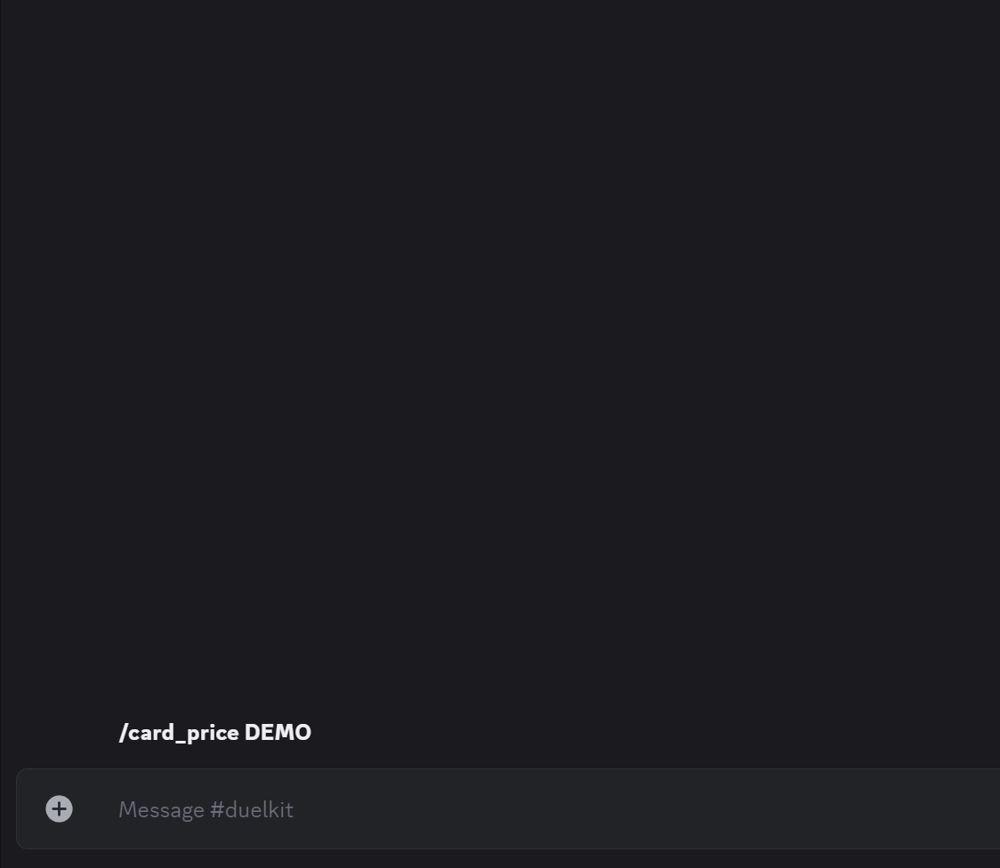test
test

<h3> 📌 Click for more info on this command</a></h3>

### Function:
Returns the 5 lowest priced listings for every printing of a Yu-Gi-Oh! card
- Returns multiple lists if there are multiple editions of that printing (*1st Edition, Unlimited, Limited*)
- Filters out OCG listings (*Korean, Japanese, Chinese, OCG, etc.*)
- Uses only verified sellers
- Filters out closely named cards (*Dark Hole -> ❌Dark Hole Dragon*)
- Checks for rarities in the card name. (*✅Dark Hole (UR)*)

### Usage: `/card_price <card_name>`
- `card_name` (**Required**): Any Yu-Gi-Oh! card name. (*Partial names work as well*)

### Examples:
- `/card_price <Dark Hole>`
- `/card_price <ash blossom>`
- `/card_price <infinite imperm>`

### Run time:
- `20s` to `4min` depending on number of printings

### Notes:
- This feature depends on [https://www.tcgplayer.com](https://www.tcgplayer.com) being online

## /feedback

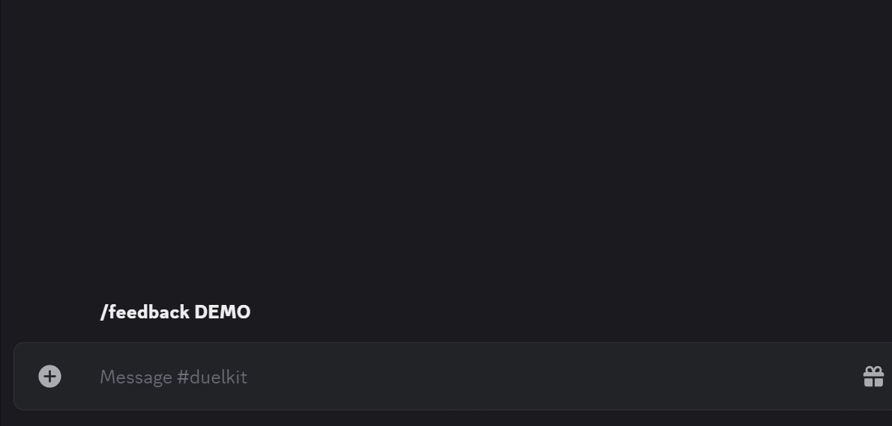

<h3> 📌 Click for more info on this command</a></h3>

### Function:
Sends the creator of **Duelkit** (*@balboni*) your message through Discord

### Usage: `/feedback <input>`
- `input` (**Required**): The message you want to send

### Examples:
- `/feedback <This bot is the best thing i've ever seen in my life!>`
- `/feedback <This command broke for me... >`
- `/feedback <It would be great if this feature could also do this... >`
- `/feedback <Could you add this feature? I have this use case for it... >`

### Run time:
- `instant`

### Notes:
- `30min` cooldown between uses

## /help

### Function:
Shows a pagination view of all available commands with basic descriptions and previews
- You can go to a different page by clicking `>` and `<`
- The current page is displayed at the bottom

### Usage: `/help`

### Run time:
- `instant`
- `2-5s` per page load

### Notes:
- Automatically launched when the bot is first invited to a server
- Due to Discord's embed system, the message must delete and re-send to update gifs on each page

## /masterpack

<h3> 📌 Click for more info on this command</a></h3>

### Function:
Posts the link to open Master Packs on [https://ygoprodeck.com/](https://ygoprodeck.com/)
- Clicking the title will display a preview of all cards within Master Duel's Master Packs
- Clicking on the second link will open the pack simulator, used to open your Master Packs
- Clicking on any of the names will copy the respective archetype or pack title

### Usage: `/masterpack`

### Run time:
- `instant`

### Notes:
- Remember to swap the `Product` to `Master Duel` within YGOPRODeck's pack simulator

## /metaltronus_decklist

<h3> 📌 Click for more info on this command</a></h3>

### Function:
Returns every monster in your opponents deck that is a valid Metaltronus target for your deck, 
    followed by the list of monsters from your deck that can be summoned off that target.
- Output is a `.txt file` you can preview and download from the message
- Monster results are in order of appearance found in the opponent's decklist
- Takes into account all Extra Deck, Main Deck and Side Deck monsters
- Filters out all spell and trap cards in both lists
- Filters out any text (*Created by, main deck, etc.*)
- Only accepts a list of ids (*✅89631139, 89631139...*) not text (*❌3 Blue-Eyes White Dragon*)

### Usage: `/metaltronus_decklist <opponents_clipboard_ydk> <your_clipboard_deck> <opponents_ydk_file> <your_ydk_file>`
- **NOTE:** You can choose to upload a `file` or a `clipboard ydk` for either decklist, but atleast 1 for each "player" is required
- `opponents_clipboard_ydk` (*Optional*):
- `your_clipboard_deck` (*Optional*): 
  - Paste the output into these options when exporting a deck and choosing the `To clipboard` option
- `opponents_ydk_file` (*Optional*):
- `your_ydk_file` (*Optional*): 
  - Upload a `.ydk file` to these options when exporting a deck and choosing `Download YDK` option

### Examples:
- `/metaltronus_decklist <#Created by YGO Omega #tags= #main 32731036 32731036 68304193 ...> <#Created by YGO Omega #tags= #main 89631139 89631139 17947697 ...>`
- `/metaltronus_decklist <maliss.ydk> <blue-eyes.ydk>`
- `/metaltronus_decklist <maliss.ydk> <#Created by YGO Omega #tags= #main 89631139 89631139 17947697 ...>`

### Run time:
- `2s`

### Notes:
- Monsters in your opponent's deck that do not have a target are listed at the bottom of the file
- Identical monsters in your opponent's deck and your deck are not listed

## /metaltronus_single

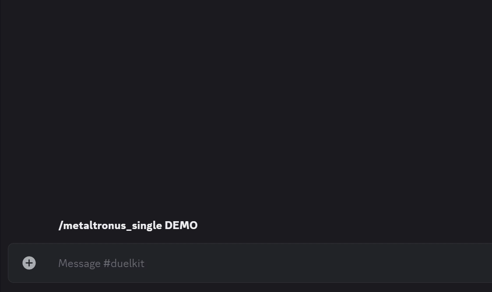

<h3> 📌 Click for more info on this command</a></h3>

### Function:
Returns every monster in in the game that is a valid Metaltronus target for the entered monster
- Output is a `.txt file` you can preview and download from the message
- Results are in alphabetical order
- Takes into account all Extra Deck and Main Deck monsters in its search

### Usage: `/metaltronus_single <monster_name>`
- `monster_name` (**Required**): Any Yu-Gi-Oh! monster card name. (*Partial names work as well*)

### Examples:
- `/metaltronus_single <Summoned Skull>`
- `/metaltronus_single <ash blossom>`
- `/metaltronus_single <infinite imperm>`

### Run time:
- `2s`

### Notes:
- The searched monster is excluded from the list of results

## /report

<h3> 📌 Click for more info on this command</a></h3>

### Function:
Reports a game's result in **the same channel** a tournament has been created in
- This command can be used on any created tournament
- Output is a message with a button to select each particpant as the winner, and a cancel button
  - Followed by a temporary message notifying everyone of the game result
- Requires a tournament to exist in the channel the command is used in
- You can directly select the pairing through the autofill feature when running the command or type it out
- You can also copy a pairing by cliking on it
- If this is the first game reported, the tournament embed will update with statuses for each game
- Can overwrite a previous result
- You can click the "Cancel" button or dismiss the message to exit
- Saves the results to a .xslx file once every game has a result

### Usage: `/report <pairing>`
- `pairing` (**Required**): The text of the game you are reporting.
- **NOTE:** the " vs " is required between the names and the order of names must be the same

### Examples:
- `/report <Mike vs Evan>`
- `/report <mike vs evan>`

### Run time:
- `instant`

### Notes:
- The .xslx file created when the full tournament finishes is available by request

## /roundrobin

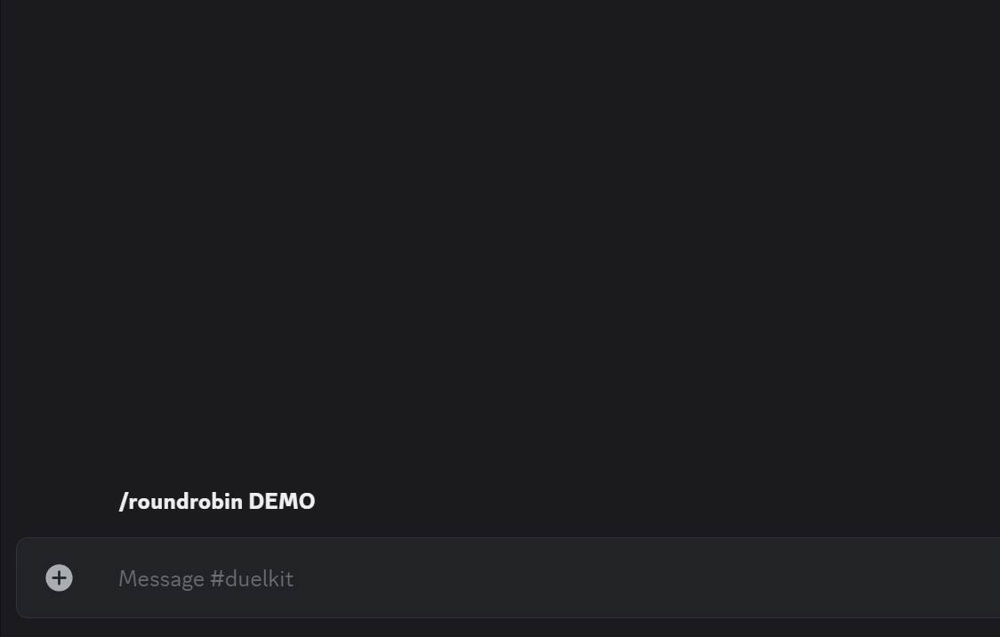

<h3> 📌 Click for more info on this command</a></h3>

### Function:
Creates a 3-8 person round robin tournament
- This command **must be used within a Channel, that is inside a Discord Category**
  - This is because every tournament created within the same category, and different channels, will be grouped together for season standings
  - There should only be one tournament per channel
  - Any new tournaments created in the same channel will override the saved data for the previous one
- Created pairings follow a fixed template, and then randomized
  - This is so players will sit out for the minimum amount of time possible between rounds
- Rounds may have multiple pairings
  - These games are intended to be played simultaniously to help speed up larger tournaments
- Player names are automatically capitalized

### Usage: `/roundrobin <players>`
- `players` (**Required**): A sequence of player names seperated by spaces.

### Examples:
- `/roundrobin <Mike Ben Evan>`
- `/roundrobin <mike ben evan svante victor mihir brian noor>`
- `/roundrobin <a b c>`

### Run time:
- `instant`

### Notes:
- This command is used along side the `/report` command to report game results.

## /secretpack_archetype

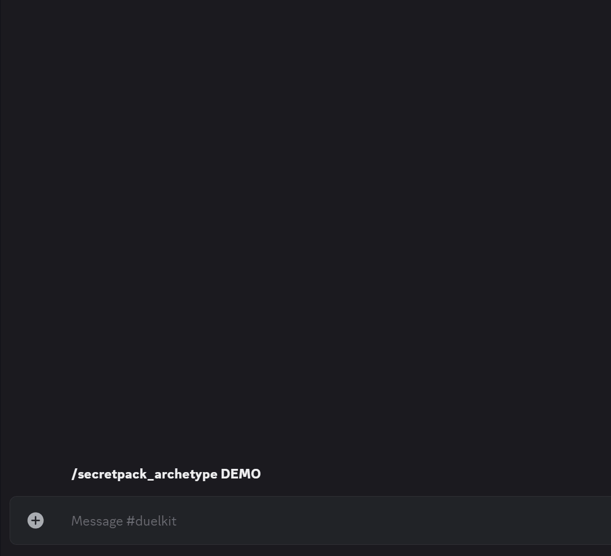

<h3> 📌 Click for more info on this command</a></h3>

### Function:
Returns a list of Master Duel Secret Packs that contain the searched archetype
- Clicking the title will display a preview of all cards within the Secret Pack
- Clicking on the second link will open the pack simulator, used to open your Secret Packs
- Clicking on any of the names will copy the respective archetype or pack title

### Usage: `/secretpack_archetype <archetype_name>`
- `archetype_name` (**Required**): Any Yu-Gi-Oh! archetype name. (*Partial names work as well*)

### Examples:
- `/secretpack_archetype <@Ignister>`
- `/secretpack_archetype <Fusion Monsters that list Synchro Monsters as material>`

### Run time:
- `instant`

### Notes:
- You can find a complete list of secret packs and their archetypes here: [List of Secret Packs](https://yugipedia.com/wiki/Secret_Pack)
- Remember to swap the `Product` to `Master Duel` within YGOPRODeck's pack simulator

## /secretpack_title

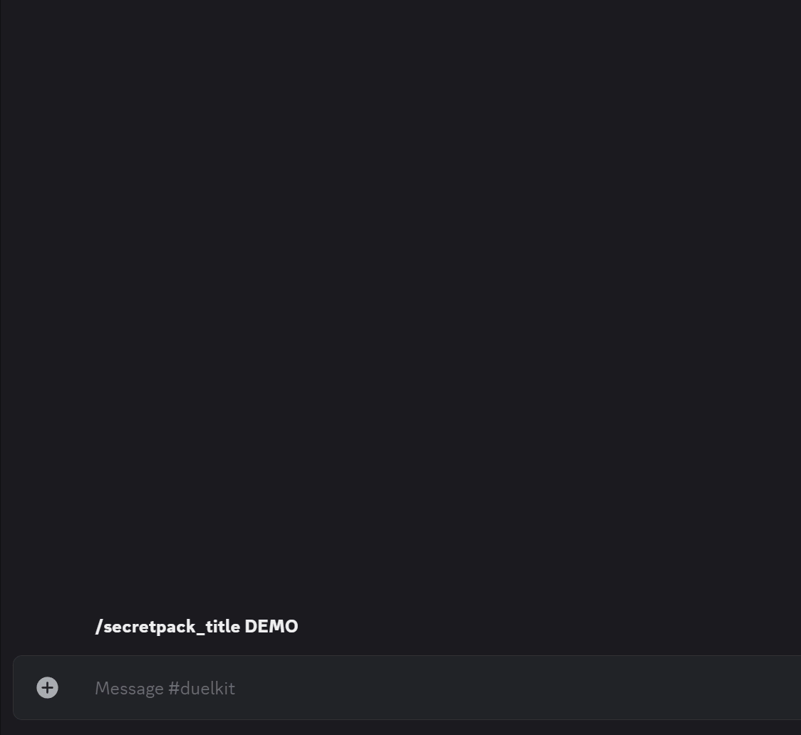

<h3> 📌 Click for more info on this command</a></h3>

### Function:
Returns a list of Master Duel Secret Packs that contain the searched title
- Clicking the title will display a preview of all cards within the Secret Pack
- Clicking on the second link will open the pack simulator, used to open your Secret Packs
- Clicking on any of the names will copy the respective archetype or pack title

### Usage: `/secretpack_title <title>`
- `title` (**Required**): Any Master Duel Secret Pack title. (*Partial names work as well*)

### Examples:
- `/secretpack_title <AI Omniscience>`
- `/secretpack_title <guardian>`

### Run time:
- `instant`

### Notes:
- You can find a complete list of secret packs and their titles here: [List of Secret Packs](https://yugipedia.com/wiki/Secret_Pack)
- Remember to swap the `Product` to `Master Duel` within YGOPRODeck's pack simulator

## /seventh_tachyon

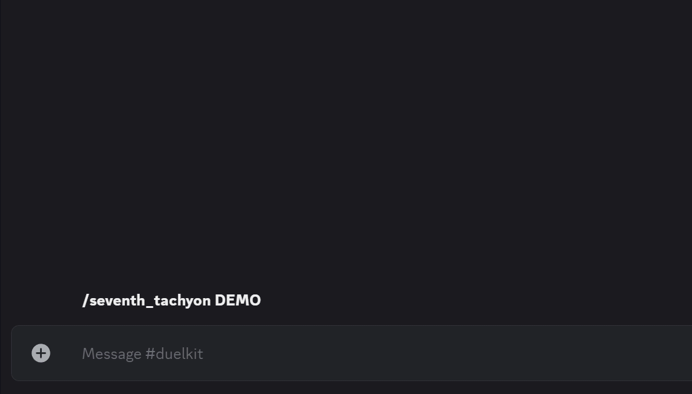

<h3> 📌 Click for more info on this command</a></h3>

### Function:
Returns every main deck monster in in the game that is a valid Seventh Tachyon target
- Output is a `.txt file` you can preview and download from the message
- Results are in alphabetical order and categorized by the initial xyz monster target
- Takes into account all Main Deck monsters in its search

### Usage: `/seventh_tachyon`

### Run time:
- `2s`

## /seventh_tachyon_decklist

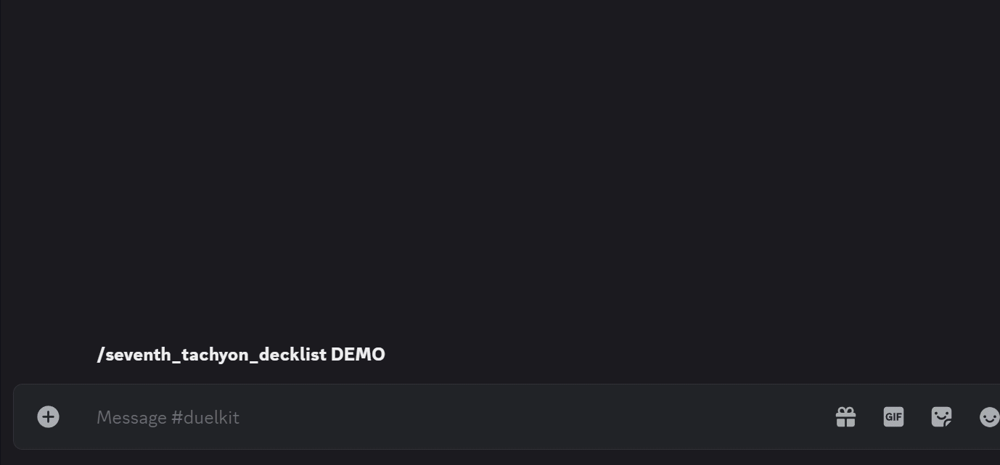

<h3> 📌 Click for more info on this command</a></h3>

### Function:
Returns every monster in your deck that is a valid Seventh Tachyon target for any of the initial xyz monsters,
- Output is a `.txt file` you can preview and download from the message
- Results are categorized by the initial xyz monster target
- It is not required to put the initial xyz monsters into your decklist
- Takes into account all Main Deck and Side Deck monsters in its search
- Filters out all spell and trap cards as well as Extra Deck monsters in your list
- Filters out any text (*Created by, main deck, etc.*)
- Only accepts a list of ids (*✅89631139, 89631139...*) not text (*❌3 Blue-Eyes White Dragon*)

### Usage: `/seventh_tachyon_decklist <clipboard_ydk> <ydk_file>`
- **NOTE:** You can choose to upload a `file` or a `clipboard ydk` for the decklist, but atleast 1 option is required
- `clipboard_ydk` (*Optional*):
  - Paste the output into this option when exporting a deck and choosing the `To clipboard` option
- `ydk_file` (*Optional*): 
  - Upload a `.ydk file` to this option when exporting a deck and choosing `Download YDK` option

### Examples:
- `/seventh_tachyon_decklist <#Created by YGO Omega #tags= #main 32731036 32731036 68304193 ...>`
- `/seventh_tachyon_decklist <maliss.ydk>`

### Run time:
- `2s`

### Notes:
- Monsters that do not have a target are not listed

## /small_world

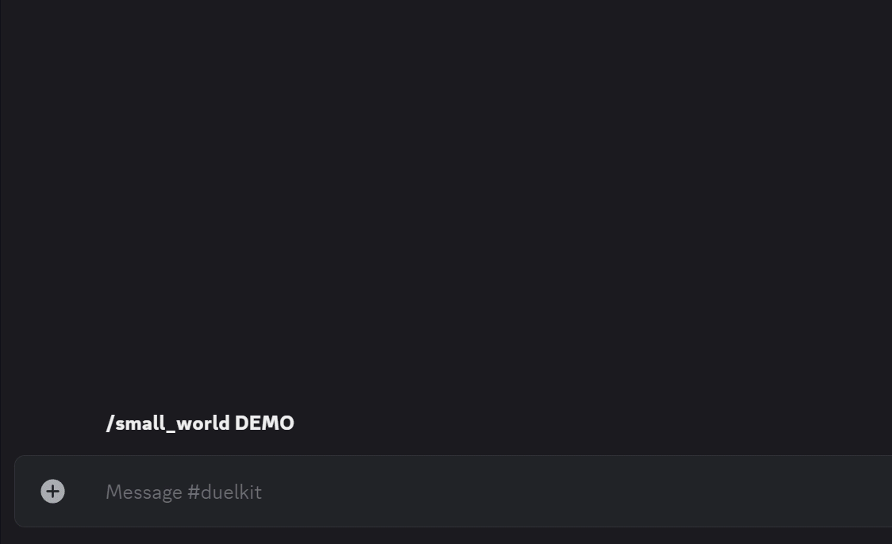

<h3> 📌 Click for more info on this command</a></h3>

### Function:
Returns a list of all the monsters that are a valid bridge between 2 entered monster names
- Output is a `.txt file` you can preview and download from the message
- Results are in alphabetical order
- Takes into account all Main Deck monsters in its search

### Usage: `/small_world <first_card> <second_card>`
- `first_card` (**Required**): Any Yu-Gi-Oh! Main Deck monster name. (*Partial names work as well*)
- `second_card` (**Required**): Any Yu-Gi-Oh! Main Deck monster name. (*Partial names work as well*)

### Examples:
- `/small_world <Tenyi Spirit - Vishuda> <Tenyi Spirit - Ashuna>`
- `/small_world <vishuda> <ashuna>`

### Run time:
- `2s`

## /small_world_decklist

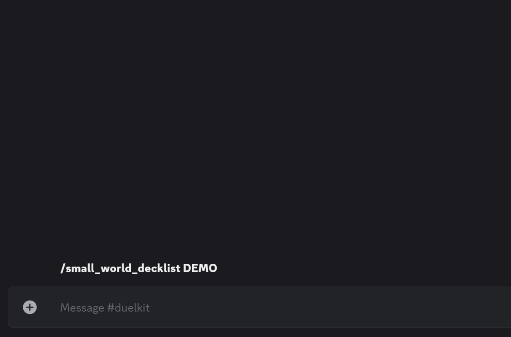

<h3> 📌 Click for more info on this command</a></h3>

### Function:
Returns every monster in your deck that is a valid bridge between any other 2 monsters in your deck,
- Output is a `.txt file` you can preview and download from the message
- Results are categorized by the bridge between 2 monsters
- Sorted by order of monsters found in the Main Deck
- Takes into account all Main Deck and Side Deck monsters in its search
- Filters out all spell and trap cards as well as Extra Deck monsters in your list
- Filters out any text (*Created by, main deck, etc.*)
- Only accepts a list of ids (*✅89631139, 89631139...*) not text (*❌3 Blue-Eyes White Dragon*)

### Usage: `/small_world_decklist <clipboard_ydk> <ydk_file>`
- **NOTE:** You can choose to upload a `file` or a `clipboard ydk` for the decklist, but atleast 1 option is required
- `clipboard_ydk` (*Optional*):
  - Paste the output into this option when exporting a deck and choosing the `To clipboard` option
- `ydk_file` (*Optional*): 
  - Upload a `.ydk file` to this option when exporting a deck and choosing `Download YDK` option

### Examples:
- `/small_world_decklist <#Created by YGO Omega #tags= #main 32731036 32731036 68304193 ...>`
- `/small_world_decklist <maliss.ydk>`

### Run time:
- `2s`

### Notes:
- Pairings that do not have a valid bridge are not listed
- Given the number of possibilites, the file is usually quite large

## /spin

<h3> 📌 Click for more info on this command</a></h3>

### Function:
Returns 5 random Master Duel Secret Packs with a preview of each
- Clicking the title will display a preview of all cards within the Secret Pack
- Clicking on the second link will open the pack simulator, used to open the Secret Pack
- Clicking on any of the names will copy the respective archetype or pack title

### Usage: `/spin`

### Run time:
- `2s`

### Notes:
- You can find a complete list of secret packs here: [List of Secret Packs](https://yugipedia.com/wiki/Secret_Pack)
- Remember to swap the `Product` to `Master Duel` within YGOPRODeck's pack simulator

## /standings

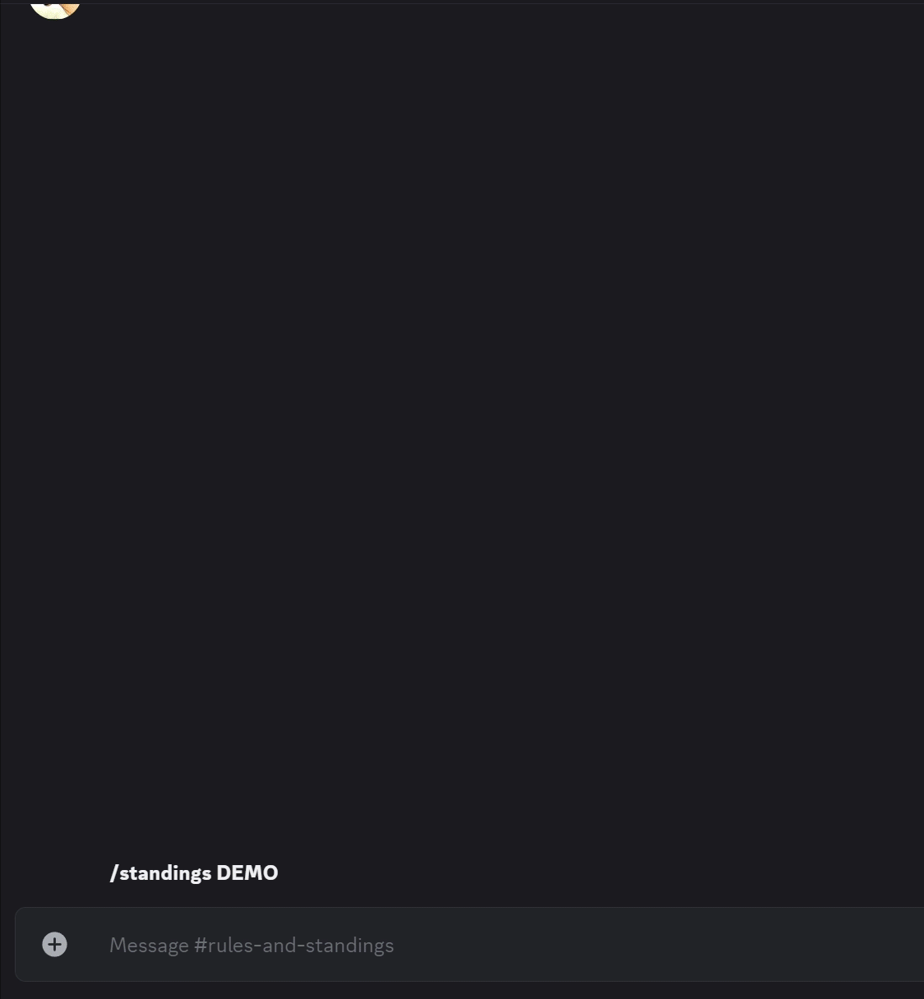

<h3> 📌 Click for more info on this command</a></h3>

### Function:
Creates 2 gifs (*1 line graph, 1 bar graph*) representing the accumulated scores across all tournaments within the category
- This command **must be used within a Channel, that is inside a Discord Category**
  - This is because every tournament created within the same category, and different channels, will be grouped together for season standings
- It is recommended to have a #rules-and-standings channel for your season-long tournaments for organization, but is not required
- If a member of server has a form of color blindness and cannot accurately read the results, please reach out using `/feedback`

### Usage: `/standings`

### Run time:
- `5s`

### Notes:
- This command is used along side the `/report` command and various other tournament creation commands to administer season-long tournaments

## /top_archetype_breakdown

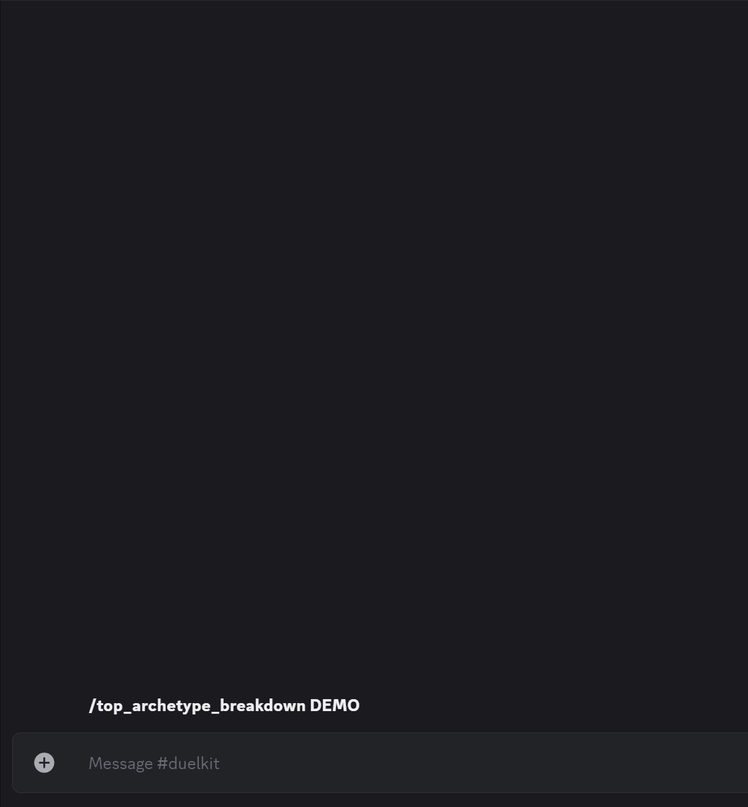

<h3> 📌 Click for more info on this command</a></h3>

### Function:
Creates a pagination view for the selected archetype, displaying every card that has appeared in a topping decklist from that archetype
- You can go to a different page by clicking `>` and `<`
- You can skip to the first and last page using `<|` and `|>`
- The current page is displayed at the bottom
- The cards are listed in alphabetical order
- The percentage next to the card name is a representation of how often the card appears in that archetype's topping decks
  - (*Found in 4/5 topping decklists for the archetype = 80%*)
- The information below the card name contains the following information:
  - Where the card is found (*Main, Extra, Side*)
  - How many copies the card was played at (*1x, 2x, 3x*)
  - How many times its appeared at that location and in that quanitity (*1,2,3,4,5,6...*)

### Usage: `/top_archetype_breakdown <archetype>`
- `archetype` (**Required**): Any Yu-Gi-Oh! archetype name. (*Partial names work as well*)

### Examples:
- `/top_archetype_breakdown <Maliss>`
- `/top_archetype_breakdown <Tenpai>`

### Run time:
- `2s`

### Notes:
- Archetypes will only appear if they have a **top in the current format**, and have **corresponding public decklists** listed on [https://ygoprodeck.com/](https://ygoprodeck.com/)
- Overall data is pulled from [https://ygoprodeck.com/](https://ygoprodeck.com/) using all public topping decklists for the current format
- Data is updated automatically every 24 hours

## /top_archetypes

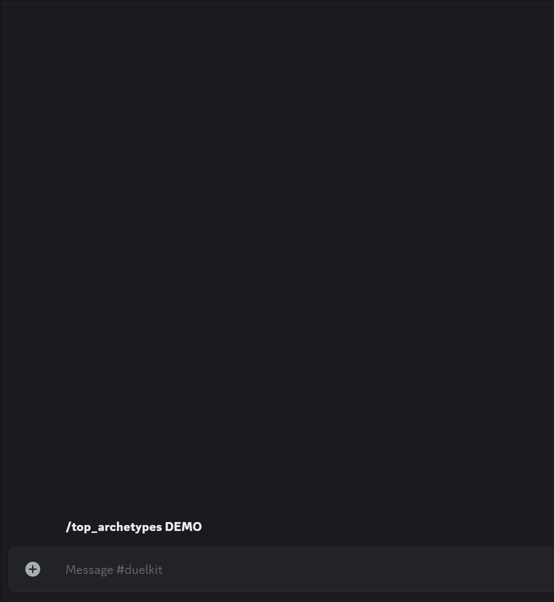

<h3> 📌 Click for more info on this command</a></h3>

### Function:
Creates a pagination view of all the topping archetypes in the current format, displaying every variant of the decklists, their quanitity, and if they won an event
- You can go to a different page by clicking `>` and `<`
- You can skip to the first and last page using `<|` and `|>`
- The current page is displayed at the bottom
- The archetypes are listed in order of event tops
- The percentage next to the archetype name is a representation of how many tops that archetype has in proportion to the rest of the meta
  - (*That Archetype has 30 of the 200 topping decklists for the current format = 15%*)
- The information below the archetype name contains the decklist variant names, and their number of tops
  - Decklists that have won an event are denoted by *(Wins: #)*

### Usage: `/top_archetypes`

### Run time:
- `2s`

### Notes:
- Archetypes will only appear if they have a **top in the current format** listed on [https://ygoprodeck.com/](https://ygoprodeck.com/)
- A deck variant will only appear if they have a **Public Decklist** listed on [https://ygoprodeck.com/](https://ygoprodeck.com/)
- Overall data is pulled from [https://ygoprodeck.com/](https://ygoprodeck.com/) using all public topping decklists for the current format
- Data is updated automatically every 24 hours

## /top_cards

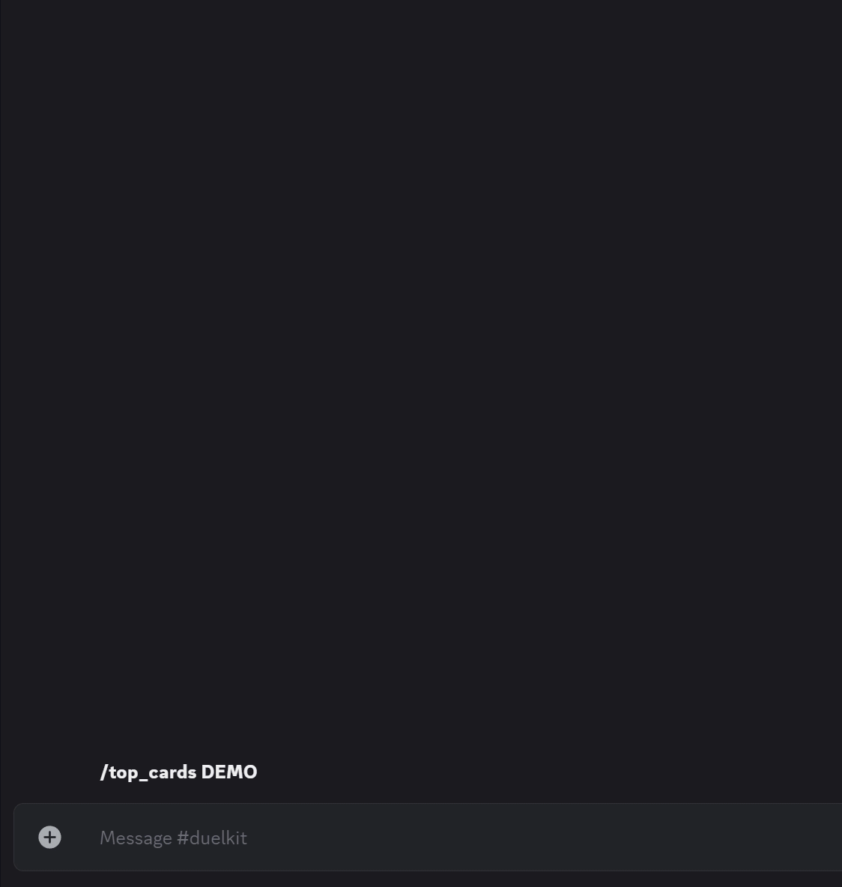

<h3> 📌 Click for more info on this command</a></h3>

### Function:
Creates a pagination view for the selected card, displaying every location (*Main, Extra, Side*) it has appeared in, the number of occurances, sorted by archetype
- You can go to a different page by clicking `>` and `<`
- The current page is displayed at the bottom
- The archetypes are listed in alphabetical order
- The percentage next to the archetype name is a representation of how often the card appears in that archetype's topping decks
  - (*Found in 4/5 topping decklists for the archetype = 80%*)
- The information below the card name contains the following information:
  - Where the card is found (*Main, Extra, Side*)
  - How many copies the card was played at (*1x, 2x, 3x*)
  - How many times its appeared at that location and in that quanitity (*1,2,3,4,5,6...*)

### Usage: `/top_cards <card_name>`
- `card_name` (**Required**): Any Yu-Gi-Oh! card name. (*Partial names work as well*)

### Examples:
- `/metaltronus_single <Dark Hole>`
- `/metaltronus_single <ash blossom>`
- `/metaltronus_single <infinite imperm>`

### Run time:
- `2s`

### Notes:
- Archetypes will only appear if they have a **top in the current format**, and have **corresponding public decklists using the card** listed on [https://ygoprodeck.com/](https://ygoprodeck.com/)
- Overall data is pulled from [https://ygoprodeck.com/](https://ygoprodeck.com/) using all public topping decklists for the current format
- Data is updated automatically every 24 hours

## /tournamentinfo

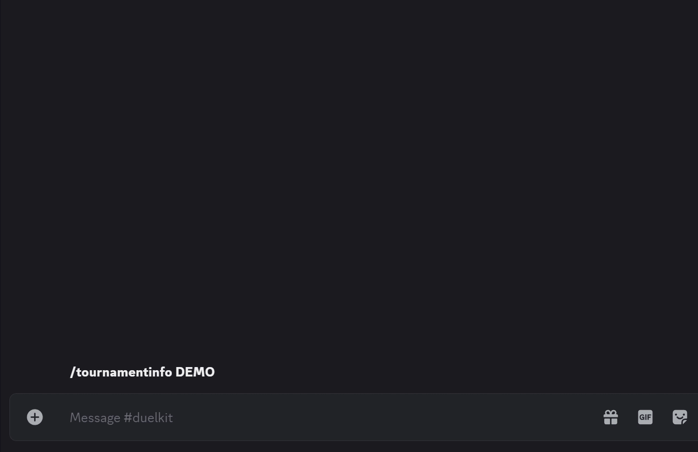

<h3> 📌 Click for more info on this command</a></h3>

### Function:
Outputs information on what record you need to make a certain top cut breakpoint or invite breakpoint, for a given tournament size
- The results of this function are an **estimation** using a formula, and **cannot account for tie breakers**
  - (*An extreme example: its possible that every player ties every round of the tournament*)
- It is possible that in the final round of a tournament, the undefeated player will play someone with 1 loss
  - Since the undefeated player can still lose that round, it is possible to have no players better than 1 loss
  - When this happens, results are displayed as a range of numbers (*0-1, 22-23*)
  - Remember that this is an estimation and it is possible to have a few more, or a few less players in each section of the results when players have tied a round
- When the results state something like: `better than 7-1 (22-24 points)`,
  - this means you must have more points than that record (*in this case more than 21 points*), the accepted range is listed in parenthesis
- In Yu-Gi-Oh!, A **win** is worth `3 points`, A **draw** is worth `1 point`, and a **loss** is worth `no points`
- Breakpoints for top cut and the number of rounds are taken from the **Konami rulebook**
- The number of invites are taken from the **TheSideDeck**

### Usage: `/tournamentinfo <number_of_players>`
- `number_of_players` (**Required**): Number of players in the tournament. (*Must be a whole number 16,100...*)

### Examples:
- `/tournamentinfo <250>`
- `/tournamentinfo <5000>`

### Run time:
- `instant`

### Notes:
- The formula used for determining placements is as follows:
  - placement = (# of players / 2 ^ # of rounds) * (# of rounds) * (# of rounds - 1 / 2) ... adds on as losses increase

Example: 64 person tournament with 6 rounds
  - P0 = (64/2^6) = 1    *1 person better than 5-1*
  - P1 = (64/2^6)(6) = 6    *6 people better than 4-2*
  - P2 = (64/2^6)((6)*(5/2)) = 15
  - P3 = (64/2^6)((6)*(5/2)*(4/3)) = 20
  - P4 = (64/2^6)((6)*(5/2)*(4/3)*(3/4)) = 15
  - and so on...

## /update
Updates all the databases found within the bot

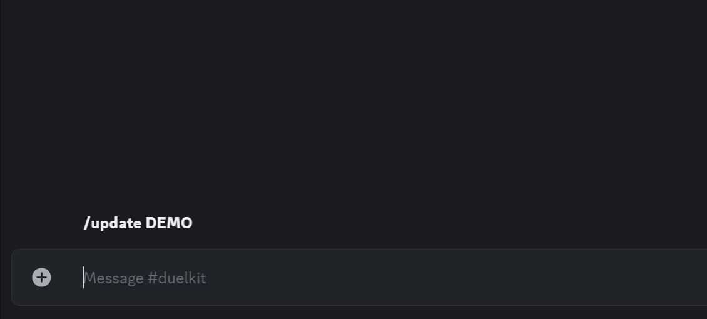

<h3> 📌 Click for more info on this command</a></h3>

### Function:
Updates all the full card database from the Konami API, then updates all derivative databases within the bot, finally collects and saves all topping decklists from [https://ygoprodeck.com/tournaments/top-archetypes/](https://ygoprodeck.com/tournaments/top-archetypes/)
- This command is run automatically every 24 hours
- This command can take a long time to complete as the current format progresses and more topping decklists are posted
- The databases created from this command are used by the majority of commands found within this bot
- Databases are only overwritten with new information if finding/creating the new data was successful

### Usage: `/update`

### Run time:
- `up to 15min` depending on number of topping decklists

### Notes:
- This command is disabled for the public and exists for developer purposes

