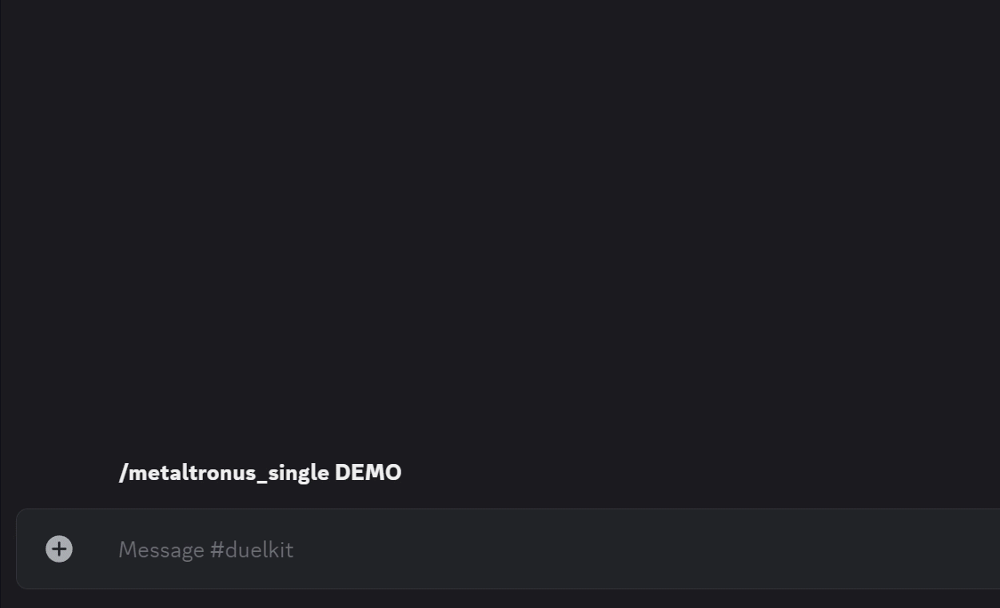
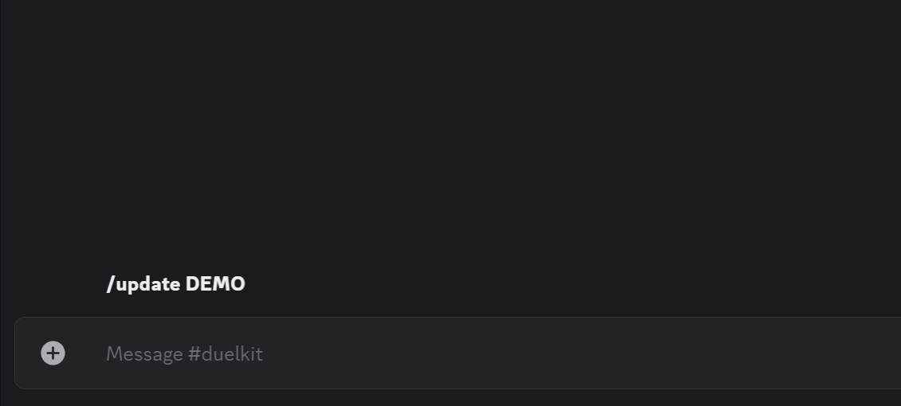

# Welcome to Duelkit!

## List of Commands:

| Command | Description |
|:------|:------|
| [/card_price](#card_price) | View a card's pricing from TCG Player |
| [/feedback](#feedback) | Send the creator of Duelkit a message! |
| [/help](#help) | Learn more about the list of available commands, with previews! |
| [/masterpack](#masterpack) | Posts the link to open Master Packs |
| [/metaltronus_decklist](#metaltronus_decklist) | Lists all the Metaltronus targets your deck has against another deck |
| [/metaltronus_single](#metaltronus_single) | Lists all the Metaltronus targets for a specific card |
| [/report](#report) | Report a game's result |
| [/roundrobin](#roundrobin) | Create a 3-8 player Round Robin tournament, please enter names with spaces inbetween |
| [/secretpack_archetype](#secretpack_archetype) | Search for a specific Secret Pack by archetype |
| [/secretpack_title](#secretpack_title) | Search for a specific Secret Pack by its title |
| [/seventh_tachyon](#seventh_tachyon) | Create list of all the current Seventh Tachyon targets in the game |
| [/seventh_tachyon_decklist](#seventh_tachyon_decklist) | Lists all the Seventh Tachyon targets in your decklist |
| [/small_world](#small_world) | Find all the valid Small World bridges between 2 cards |
| [/small_world_decklist](#small_world_decklist) | Find all the valid Small World bridges within a decklist |
| [/spin](#spin) | Spin 5 random Secret Packs! |
| [/standings](#standings) | See current season standings |
| [/top_archetype_breakdown](#top_archetype_breakdown) | View a card-by-card breakdown of a top archetype for the current format |
| [/top_archetypes](#top_archetypes) | View the top archetypes for the current format |
| [/top_cards](#top_cards) | View a card's usage across all topping archetypes |
| [/tournamentinfo](#tournamentinfo) | Find out what record is needed to receive an Invite or make Top Cut, for a given number of players |
| [/update](#update) | Updates all the databases found within the bot (takes a while to run) |

## /card_price

### Function:
Returns the 5 lowest priced listings for every printing of a Yu-Gi-Oh! card
- Returns multiple lists if there are multiple editions of that printing. (*1st Edition, Unlimited, Limited*)
- Filters out OCG listings (*Korean, Japanese, Chinese, OCG, etc.*)
- Uses only verified sellers
- Filters out closely named cards (*Dark Hole -> ❌Dark Hole Dragon*)
- Checks for rarities in the card name. (*✅Dark Hole (UR)*)

### Usage: `/card_price <card_name>`
- `card_name` (**Required**): Any Yu-Gi-Oh! card name. (*Partial names work as well*)

### Examples:
- `/card_price <ash blossom>`
- `/card_price <Dark Hole>`

### Run time:
- `20s` to `4min` depending on number of printings

### Notes:
- This feature depends on [https://www.tcgplayer.com](https://www.tcgplayer.com) being online

---

## /feedback

### Function:
Sends the creator of Duelkit (@balboni) your message through discord

### Usage: `/feedback <input>`
- `input` (**Required**): The message you want to send

### Examples:
- `/feedback <This bot is the best thing i've ever seen in my life!>`
- `/feedback <This command broke for me: ...>`
- `/feedback <It would be great if this feature could also do this: ...>`
- `/feedback <Could you add this feature? I have this use case for it: ...>`

### Run time:
- `instant`

### Notes:
- `30min` cooldown between uses

---

## /help

### Function:
Shows a pagination view of all commands with basic descriptions and previews

### Usage: `/help`

### Run time:
- `instant`
- `2-5s` per page load

### Notes:
- Automatically launched when the bot is first invited to a server
- Due to Discord's embed system, the message must delete and re-send to update gifs on each page

---

## /masterpack

### Function:
Posts the link to open Master Packs on [https://ygoprodeck.com/](https://ygoprodeck.com/)
- Clicking the title will display a preview of all cards within Master Duel's Master Packs
- Clicking on the second link will open the pack simulator to open your Master Packs
- Clicking on any of the names will copy the respective archetype or pack title

### Usage: `/masterpack`

### Run time:
- `instant`

### Notes:
- Remember to swap the `Product` to `Master Duel` within YGOPRODeck's pack simulator

---

## /metaltronus_decklist
Lists all the Metaltronus targets your deck has against another deck

### Function:
Returns every monster in your opponents deck that is a valid Metaltronus target for your deck, 
    followed by the list of monsters from your deck that can be summoned off that target.
- Output is a .txt file you can preview and download from the message
- Takes into account all Extra Deck, Main Deck and Side Deck monsters
- Filters out all spell and trap cards in both lists
- Filtsers out any text (*Created by, main deck, etc.*)
- Only accepts a list of ids (*✅89631139, 89631139...*) not text (*❌3 Blue-Eyes White Dragon*)

### Usage: `/metaltronus_decklist <opponents_clipboard_ydk> <your_clipboard_deck> <opponents_ydk_file> <your_ydk_file>`
- **NOTE:** You can choose to upload a **file** or a **clipboard ydk** for either decklist, but atleast 1 for each "player" is required
- `opponents_clipboard_ydk` (*Optional*): Paste the output into this option when exporting a deck and choosing the `To clipboard` option
- `your_clipboard_deck` (*Optional*): Paste the output into this option when exporting a deck and choosing the `To clipboard` option
- `opponents_ydk_file` (*Optional*): Upload a `.ydk file` to this option when exporting a deck and choosing `Download YDK` option
- `your_ydk_file` (*Optional*): Upload a `.ydk file` to this option when exporting a deck and choosing `Download YDK` option

### Examples:
- `/metaltronus_decklist <#Created by YGO Omega #tags= #main 32731036 32731036 68304193 ...> <#Created by YGO Omega #tags= #main 89631139 89631139 17947697 ...>`
- `/metaltronus_decklist <maliss.ydk> <blue-eyes.ydk>`
- `/metaltronus_decklist <maliss.ydk> <#Created by YGO Omega #tags= #main 89631139 89631139 17947697 ...>`

### Run time:
- `3s`

### Notes:
- Monsters in your opponent's deck that do not have a target are listed at the bottom of the file
- Identical monsters in your opponent's deck and your deck are not listed

---

## /metaltronus_single

### Function:
Returns every monster in in the game that is a valid Metaltronus target for the entered monster
- Output is a .txt file you can preview and download from the message
- Takes into account all Extra Deck and Main Deck monsters in its search

### Usage: `/metaltronus_single <monster_name>`
- `monster_name` (**Required**): Any Yu-Gi-Oh! monster card name. (*Partial names work as well*)

### Examples:
- `/metaltronus_single <ash blossom>`
- `/metaltronus_single <Summoned Skull>`

### Run time:
- `3s`

### Notes:
- The monster itself is excluded from the list of results

---

## /report
Report a game's result

---

## /roundrobin
Create a 3-8 player Round Robin tournament, please enter names with spaces inbetween

---

## /secretpack_archetype
Search for a specific Secret Pack by archetype

---

## /secretpack_title
Search for a specific Secret Pack by its title

---

## /seventh_tachyon
Create list of all the current Seventh Tachyon targets in the game

---

## /seventh_tachyon_decklist
Lists all the Seventh Tachyon targets in your decklist

---

## /small_world
Find all the valid Small World bridges between 2 cards

---

## /small_world_decklist
Find all the valid Small World bridges within a decklist

---

## /spin
Spin 5 random Secret Packs!

---

## /standings
See current season standings

---

## /top_archetype_breakdown
View a card-by-card breakdown of a top archetype for the current format

---

## /top_archetypes
View the top archetypes for the current format

---

## /top_cards
View a card's usage across all topping archetypes

---

## /tournamentinfo
Find out what record is needed to receive an Invite or make Top Cut, for a given number of players

---

## /update
Updates all the databases found within the bot

- more info!
- more info!
- more info!

---
